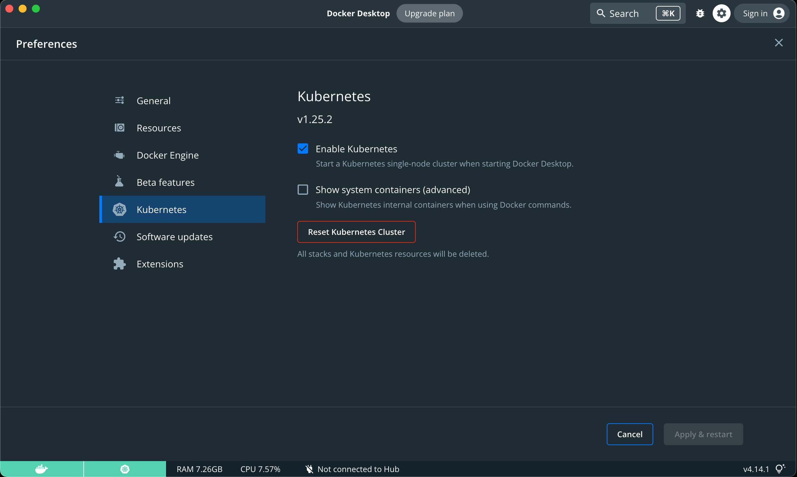

# `Docker Desktop for Mac` 开启并使用 `Kubernetes`

`Docker Desktop` 可以方便的启用 `Kubernetes` 集群, 为学习 `Kubernetes` 提供了极大的便利, 但是由于众所周知的原因, 国内的网络下不能很方便的下载 `Kubernetes` 集群所需要的镜像, 导致集群启用失败. 这里提供了一个简单的方法, 利用 [GitHub Actions](https://developer.github.com/actions/creating-github-actions/) 实现 `k8s.gcr.io` 上 `kubernetes` 依赖镜像自动同步到 [Docker Hub](https://hub.docker.com/) 上指定的仓库中。 通过 [load_images.sh](./load_images.sh) 将所需镜像从 `Docker Hub` 的同步仓库中取回，并重新打上原始的`tag`. 镜像对应关系文件可以查看: [images](./images).

说明:

- 当前在 `Docker Desktop (Mac) Version 2.1.0.0 (36792) Channel: edge (Kubernetes: v1.14.3)`上经过测试可用
- 使用 `Kubeadm` 在`Ubuntu`上安装 `Kubernetes` 请查看 [kubernetes-for-china](https://github.com/maguowei/kubernetes-for-china)

## 安装并设置

1. 下载安装 [Docker Desktop (Mac) Channel: edge](https://download.docker.com/mac/edge/Docker.dmg)

2. 设置 `Docker` 镜像加速, 这里使用 微软 `Azure` 的镜像服务，也可以选择其他的镜像加速服务。 [Azure Container Registry Proxy](https://github.com/Azure/container-service-for-azure-china/blob/master/aks/README.md#22-container-registry-proxy) ```https://dockerhub.azk8s.cn```


3. 从 `Docker Hub` 的同步仓库中取回，并重新打上原始的`tag`.

```bash
./load_images.sh
```

4. 在`Docker for Mac` 设置中启用 `Kubernetes` 选项, 并等待一会儿，直到 `Kubernetes` 开始运行。



5. 可选的步骤: 切换`Kubernetes`运行上下文至 `docker-desktop`

```bash
# 一般只有在之前用其他方式运行过Kubernetes才需要
$ kubectl config use-context docker-desktop
```

6. 验证 `Kubernetes` 集群状态

```bash
$ kubectl cluster-info
$ kubectl get nodes
$ kubectl describe node
```

7. 部署 `Kubernetes dashboard`

```bash
$ kubectl apply -f https://raw.githubusercontent.com/kubernetes/dashboard/v1.10.1/src/deploy/recommended/kubernetes-dashboard.yaml

# 开启本机访问代理
$ kubectl proxy
```

通过下面的连接访问 `Dashboard`:
[`http://localhost:8001/api/v1/namespaces/kube-system/services/https:kubernetes-dashboard:/proxy/`](
http://localhost:8001/api/v1/namespaces/kube-system/services/https:kubernetes-dashboard:/proxy/)

创建`Dashboard`管理员用户并用`Token`登陆:
[`https://github.com/kubernetes/dashboard/wiki/Creating-sample-user`](https://github.com/kubernetes/dashboard/wiki/Creating-sample-user)

## [Helm](https://helm.sh/)

```bash
# 用 homebrew 安装 Helm
$ brew install kubernetes-helm

# 初始化本地 CLI 并 将 Tiller 安装到 Kubernetes cluster
$ helm init

# 更新本地 charts repo
$ helm repo update

# 安装 mysql chart
$ helm install --name my-mysql stable/mysql

# 删除 mysql
$ helm delete my-mysql

# 删除 mysql 并释放该名字以便后续使用
$ helm delete --purge my-mysql
```

## 参考

- [Kubernetes Documentation](https://kubernetes.io/docs/home/)
- [kubectl Cheat Sheet](https://kubernetes.io/docs/reference/kubectl/cheatsheet/)
- [Awesome-Kubernetes](https://github.com/ramitsurana/awesome-kubernetes)
